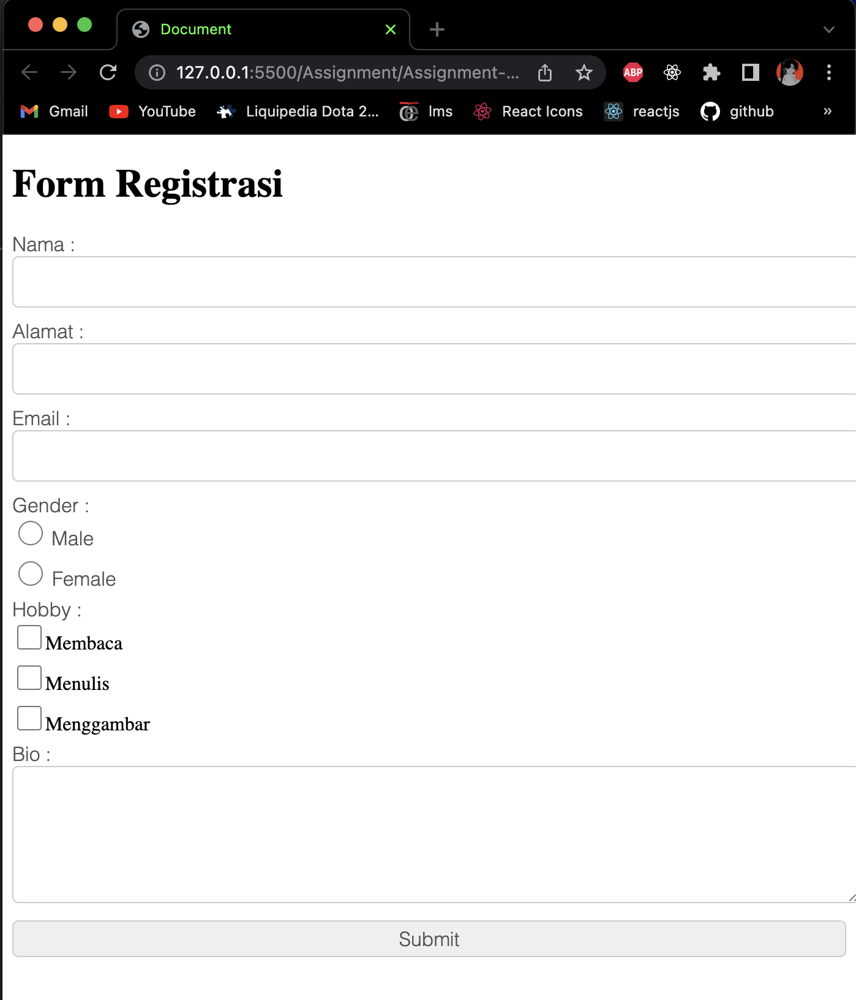
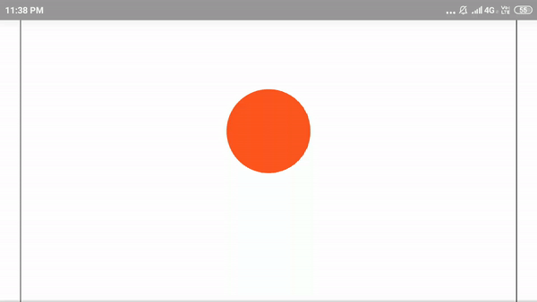

# Assignment-1
1. Create a simple registration form using css and html (feel free to add styles other than the examples given)
2. Create a bouncing ball animation using css and html (feel free to use any animation other than the examples given)

Example of registration form:

Example of bouncing ball animation:

### Sincerly,
ESD Laboratory Software Development Team